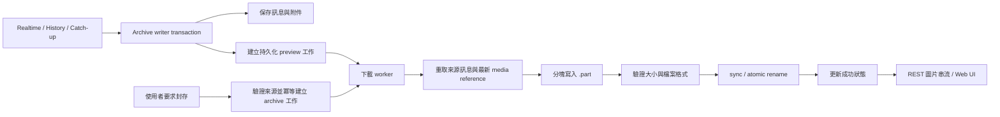

# Telegram 圖片自動下載設計

本文件為待實作設計；目前版本尚未提供圖片檔案下載。採用「自動下載預覽，使用者明確要求後才下載封存」策略。

## 目前能力與限制

- `Attachment`／`attachments` 表保存 kind、Telegram media ID、MIME、名稱、大小；沒有本地檔案與下載狀態。
- mapper 保存的 `telegram_file_id` 是 photo/document 的數字 ID，不是可直接交給 Bot API 下載的 file ID。
- 現有 Grammers 提供 `get_messages_by_id`、`iter_download`。下載沿用 `TelegramAdapter` 當前 client 與帳號 owner，不另開 Telegram session。
- 附件更新使用 delete + insert；下載工作不能以現有 `attachments.id` 作為長期唯一識別。
- Telegram file reference 會過期；依 `(chat_id, message_id)` 重取來源訊息可取得新 reference。來源不存在／失去存取權限時，未下载的檔案可能無法取得。

來源：本專案 domain、mapper、SQLite writer、vendored Grammers files/messages 實作；[Telegram file references](https://core.telegram.org/api/file-references)。

## V1 產品行為

- `MEDIA_AUTO_DOWNLOAD=preview` 為預設，設為 `off` 可停用自動下載；自動下載只處理 tracked chats。
- `off` 只停止自動排程；具備 Telegram 連線的 `serve` 仍提供手動封存下載。附件保留穩定 preview 記錄，尚未排程時為 `not_requested`，因此不依賴預覽已下載才能要求封存。
- preview：Photo 選擇長邊不超過 800px 的最大可用正常點陣版本，優先選 `x`；略過 stripped/path 等特殊縮圖。不存在符合尺寸的版本時明示預覽不可取得。
- archive：Photo 選擇最大可用版本；以 document 傳送的 JPEG／PNG／WebP 則下載完整檔案。Photo 的最大尺寸不等同於上傳前的原始檔。
- image document 的自動 preview 只使用 Telegram 提供的合適縮圖；沒有縮圖時顯示附件占位與封存下載按鈕，不自動下載完整 document 來產生預覽。
- 新訊息、編輯、catch-up 與歷史同步只自動排入 preview 工作；archive 只能由使用者點擊／明確 API 請求建立。頁面載入、圖片放大、工作重試或歷史同步不隱含升級為 archive。
- 已存檔圖片透過「補下載預覽」明確排入工作，不在升級啟動時直接掃描整個歷史資料庫；此操作亦不建立 archive 工作。
- 預設 1 個下載 worker，每檔上限 20 MiB；上限以實際串流位元組數強制執行，未知大小亦適用。
- 檔案保存於 `/data/media`，沿用現有 compose 的 `/data` bind mount。
- Web UI 分別呈現 preview 與 archive 狀態；點擊「下載封存版本」後顯示排隊／下載中／失敗重試，完成後可查看或下載封存圖。放大預覽本身仍使用本地 preview。
- 本地成功檔案在 query-only 模式仍可瀏覽；需要 Telegram 的新下載請求明示目前沒有下載 worker。
- untrack 停止新的自動下載，尚未執行的自動工作停止；重新 track 可補下載 preview。已存檔、未刪除訊息的明確手動 archive 請求不要求重新 track。
- 已下載檔案保留；已刪除訊息的圖片不透過一般圖片路由公開。自動刪檔政策另行決定。
- 延後封存有實際限制：若使用者點擊前來源訊息已刪除、換圖或失去權限，大圖可能無法取得；已下載的 preview 仍保留。

## 工作流程

writer 在訊息與附件交易中只建立 preview 工作，commit 後即完成訊息 ACK；不等待檔案下載。archive 工作由明確請求在獨立短交易中建立。下載 worker 從 DB 拉取少量工作，記憶體通知僅用來喚醒，不能作為唯一工作來源。

僅針對 writer 實際接受的最新附件建立工作；被版本規則拒絕的舊 history event 不建立舊圖片工作。Refetch 補足附件 metadata 時也走同一排程規則。

## 持久化資料

新增 `media_downloads`，保留現有 attachments 表的 metadata 語意：

| 欄位 | 用途 |
|---|---|
| id | 穩定工作 ID，亦用於本地檔名與 API |
| chat_id、message_id、ordinal | 原始訊息與附件位置 |
| media_kind、telegram_media_id、variant | media 身分；variant 僅 preview / archive |
| trigger | auto / manual，用於 untrack 與排程政策 |
| selected_type、width、height | 實際 Telegram 尺寸識別與下載後的圖片尺寸 |
| state | not_requested / queued / running / succeeded / failed / unavailable / superseded |
| relative_path、content_type、byte_size | 已驗證的本地檔案資料 |
| attempts、next_attempt_at、last_error | 有限重試、限流等待與已清理的錯誤 |
| created_at、updated_at | 狀態時間 |

唯一鍵：`(chat_id, message_id, ordinal, media_kind, telegram_media_id, variant)`。重複 ingest／重複封存點擊不重複建立工作；preview 與 archive 分開保存，封存完成不覆蓋 preview。同一圖片的兩種模式若解析為同一個 Telegram 檔案版本，可共用已驗證檔案。

圖片替換建立新工作，舊工作標為 superseded。同一圖片出現在不同訊息時，V1 允許分別存檔。

成功記錄不依賴會被重新建立的 attachment row ID。對外查詢必須比對當前附件的 media 身分，避免舊圖片被當作新附件顯示。

## 下載、失敗與恢復

1. worker claim queued 工作後，再確認訊息未刪除、附件身分仍相符；auto 工作另須確認 chat 仍 tracked。
2. 以原 chat/message 查詢 Telegram 訊息，核對 media ID；若已換圖，舊工作標為 superseded，不能下載替換後的圖冒充舊圖。
3. 使用 `iter_download` 分塊寫入由程式產生名稱的私人 `.part` 檔。磁碟不足、超過大小限制立即停止並清理 partial file。
4. 核對 JPEG／PNG／WebP signature 與檔案大小後同步檔案、atomic rename、同步父目錄，再將 DB 標記 succeeded。
5. 網路錯誤有限退避重試；FloodWait 保存下一次可執行時間，等待可取消，且不持有 DB transaction。file reference 過期時重新取得來源訊息後有限重試。
6. 訊息／圖片不存在、無存取權限或格式不支援，保存可辨識狀態；不阻塞訊息同步。
7. 啟動時回收 running 工作。若 rename 後、DB 成功更新前 crash，驗證最終檔案並補記成功；partial file 在下次嘗試重新下載。已標記成功但檔案遺失，轉為可重試狀態。
8. 完成前再核對附件身分與適用的收集政策，防止下載期間的 edit/delete/untrack 造成過期圖片公開；manual archive 不因 untrack 取消。

DB 與檔案系統沒有共同 transaction，因此恢復流程需覆蓋上述兩邊的 crash window。圖片下載失敗只影響圖片狀態；共享 Telegram 連線或帳號的致命錯誤交由既有 supervisor 處理。

下載流量使用帳號級限流等待與既有 pacing 協調，優先讓訊息收集持續運作。下載 worker 納入 runtime ownership、取消與 join；取消後 partial 檔可清理，工作在下次啟動恢復。

## CLI、REST 與 Web UI

建議介面：

- `tgarchive media enqueue --chat <ID>`：為該 tracked chat 已存檔、未刪除的圖片補建立 preview 工作；冪等，不直接在 CLI 開新 Telegram owner。允許離線排程，由下次啟用下載功能的 `serve` 執行。
- `tgarchive media status`：查詢工作計數與失敗原因。
- `POST /api/v1/chats/{chat_id}/media/downloads`：只補建立 preview 工作，回傳新增／既有工作數；目前 `serve` 已啟用下載 worker 才接受，否則明示下載功能未啟用。
- `POST /api/v1/media/{preview_id}/archive`：依穩定的 preview 記錄查出來源 media 身分並建立 manual archive 工作，即使該 preview 不可取得也能請求。先確認來源仍是目前附件；已換圖回傳可辨識的 stale-media 錯誤。queued/running 回 `202` 與同一 archive ID，已完成回 `200` 與本地 URL，不重複下载；無下載 worker 則回 `503`。
- `GET /api/v1/media/{id}`：回傳 variant、state、尺寸、已清理錯誤及成功檔案 URL，供 Web UI polling。
- `GET /api/v1/media/status`：queued/running/succeeded/failed 等計數。
- `POST /api/v1/media/{id}/retry`：重新排入可重試工作，核對來源附件與該工作的 auto/manual 政策；保持原 variant，preview 重試不會下載 archive。
- `GET /api/v1/media/{id}/content`：只有已完成且目前可見的圖片才串流回應；回傳正確 MIME 與 `nosniff`。不接受使用者提供磁碟 path，也不把 `/data/media` 整個目錄直接掛成靜態網站。
- Message DTO 的附件新增 `preview`、`archive` 資料（各自的 media ID、state、尺寸、URL）；archive 尚未被要求時為 null。preview 沒有合適縮圖時仍有穩定記錄，讓使用者可以請求 archive。
- Web UI 使用本地 URL、lazy loading；GET metadata/content 都只讀取本地資料，不能觸發 Telegram 下載。archive 未要求時顯示「下載封存版本」，排隊／下載中停用按鈕並顯示狀態，完成後顯示「查看封存版本／儲存檔案」。多分頁同時點擊由後端冪等處理。

## Phases 與驗收 tasks

| Phase | Tasks | 驗收 |
|---|---|---|
| D1 資料與排程 | migration／預設 preview 設定；accepted attachment transaction 建立 preview；manual archive／補預覽／claim/recovery | 重複 ingest 不重複排程；沒有明確請求不產生 archive；rollback；edit/refetch；untrack/delete 政策 |
| D2 下載 adapter | preview 尺寸選擇／document 縮圖；archive 最大尺寸／完整檔案；media reference、串流上限與原子檔案 | 多尺寸／缺縮圖；preview 不偷偷下載大圖；兩模式共用同版本；來源換圖／刪除；過期 reference／FloodWait |
| D3 Runtime | supervised worker；帳號 pacing／取消；檔案與 DB crash reconciliation | enqueue 前後、rename 前後、DB 成功前的重啟；worker join；query-only 不連 Telegram |
| D4 使用介面 | CLI／REST／OpenAPI；preview/archive 分開狀態；Web UI 預覽、按需封存與補預覽 | POST 冪等；GET 不觸發下載；多分頁重複點擊；完成／失敗狀態；query-only；換圖不顯示舊檔 |
| D5 交付 | 設定範例／資料備份文件；自動測試；真實 Photo 與 image document 驗收 | 新訊息／歷史同步只下載 preview；點擊才下載 archive；缺縮圖／來源失效／重啟；發布新 image |

每個 phase 或已完成 task 群組驗收後 commit。真實 Telegram 下載仍需實際帳號測試；fake tests 不代表已驗證所有 Telegram 圖片類型與權限情況。
