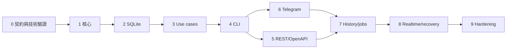

# Telegram Message Archive — 實作細節與任務拆解

本文件將 [原始實作規劃](telegram_message_archive_implementation_plan.md) 轉成可執行的設計與工作項目。原規劃仍是功能範圍與 V1 Definition of Done 的依據；本文件補足契約、資料一致性、執行順序與驗收方式。

目前起點：目錄只有規劃文件，尚無 Cargo 專案、程式碼、migration 或測試。所有 task 初始狀態皆為未完成。本次只建立執行規劃，沒有開始實作程式。

## 1. 執行方式

- 保留原本 Phase 1–9，加入 Phase 0 處理版本與 Telegram 技術驗證。
- 每個 task 是一個可獨立審查的變更；完成交付物、測試及驗收後才勾選。
- 同一 phase 的 task 依列出順序執行；另有相依性時會明列。
- REST 與 CLI 先完成本地查詢；涉及 Telegram 的命令與路由於 Phase 6–7 接上。
- 每個 phase 收尾執行 `cargo fmt --check`、該階段相關測試、`cargo clippy --all-targets -- -D warnings`。Phase 0 尚無 Cargo 專案時不適用。
- 不為未來能力先建空模組；以下路徑是預計歸屬，可在責任相同的前提下合併小檔案。
- 真實 Telegram 驗收需要 API credentials、使用者帳號和可存取的測試聊天；缺少時記錄為「待人工驗收」，不能宣稱已通過。

## 2. 實作設計

### 2.1 模組與依賴

採單一 package，提供 `src/lib.rs` 給整合測試，`src/main.rs` 僅負責入口與退出碼。

```text
src/
  lib.rs / main.rs / bootstrap.rs / config.rs
  domain/             IDs、Chat、Sender、Message、Attachment、cursor
  application/        commands、queries、ports、ingest、query、sync、status
  interface/cli/      clap、轉換輸入、human/json 輸出
  interface/rest/     Axum、DTO、錯誤映射、utoipa
  infrastructure/telegram/   session、auth、gateway、mapper、listener
  infrastructure/persistence/sqlite/   pool、repositories、交易
migrations/           SQLx migrations，放 package 根目錄方便工具使用
tests/                SQLite、REST、CLI、runtime 整合測試
```

`domain` 不引用其他專案層；`application` 只引用 domain 與通用型別／非同步工具。Axum、clap、SQLx、grammers 留在各自 adapter。Bootstrap 負責 wiring。用 `Arc<dyn Port>` 注入共用 service，不替每個方法增加一套 service trait。

### 2.2 識別碼、時間與游標

- `ChatId(i64)`、`SenderId(i64)` 必須區分 Telegram 的 user/basic group/channel namespace，不能直接將裸 peer ID 當唯一識別碼。Phase 0 固定 signed ID 編碼規則與可表示範圍，Phase 1 寫成純函式並加碰撞測試。`ChatKind` 的 supergroup/channel 共用 channel namespace。
- Sender 的 user、chat、channel 使用同一 peer 編碼；未知 sender 用 `None`，不捏造 ID。
- `MessageId(i64)` 在 adapter 驗證可轉為所選 Telegram API 的訊息 ID 型別。唯一鍵始終為 `(chat_id, message_id)`。
- domain 使用 UTC；SQLite timestamp 使用 Unix seconds，DTO 使用 RFC 3339。收集時間與 Telegram 發送／編輯時間分開保存。
- 對外 cursor：URL-safe Base64 JSON，包含 `version`、`timestamp`、`chat_id`、`message_id`。限制編碼長度，拒絕未知版本與不合法內容。
- List/search 固定按 `(timestamp DESC, chat_id DESC, message_id DESC)` 排序；search V1 不做相關度排序。
- `before` 取 sort key 更小的資料；`after` 取更大的資料，查詢用升冪取得最近一頁再反轉輸出。兩者不可同時設定。
- 一次查 `limit + 1` 判斷是否還有資料。`PageSize` 為 1–1000，預設 100。時間範圍採 `[from, to)`。
- Page 回傳 `items`、`has_more`、`next_cursor`；`next_cursor` 是沿原查詢方向續頁的邊界。filter 或方向改變時應重新開始查詢。
- 分頁不保證跨請求 snapshot；新訊息、編輯與刪除可能改變後续結果，仍需保證同 timestamp 不因排序鍵不完整而重複／漏列。

### 2.3 Application 契約

在原規劃的 ports 上補足以下契約，避免先做出無法保證交易的 API：

| Port／模型 | 最小責任 |
|---|---|
| `TelegramGateway` | list chats、依方向與邊界 fetch history；回傳 domain metadata，不能回傳 grammers peer |
| `MessageRepository` | get/list/search；查詢排除已刪除資料 |
| `ChatRepository` | get/list、一次儲存 refresh 的 chats |
| `SyncRepository` | 讀取 chat checkpoint、job/status；更新排程與失敗狀態 |
| `ArchiveWriter` | 原子寫入 ingest batch：chat/sender/message/attachments/tombstone 與可選 checkpoint |
| `SyncScheduler` | 有界提交 jobs，取得 job ID／busy/conflict；implementation 由 application coordinator 提供 |
| `IngestBatch` | events、chat/sender metadata、來源、可選 checkpoint；不帶 SQL transaction |
| `HistoryPage` | normalized records、下一個 history cursor、是否耗盡遠端 iterator |
| `ApplicationError` | Validation、NotFound、Conflict、Busy、TelegramUnavailable、RepositoryUnavailable、Internal |

`ArchiveWriter` 是實際跨表交易邊界，不能由 application 依次呼叫多個 repository 假裝具有原子性。Sender 目前只有 ingestion 寫入需求，併入 writer；若仍保留原規劃 `SenderRepository`，必須有真實 use case 消費它，否則不建立。

`IngestMessageEvent` 保留單事件入口，內部轉成 batch；history 使用 batch 入口。使用 `IngestSink`（有界 channel handle）提交帶 oneshot acknowledgement 的工作；worker 呼叫同一 ingestion use case。CLI 同步也啟動相同 worker，查詢型 CLI 不啟動 worker。

### 2.4 SQLite 與一致性

沿用原規劃 schema，增加下列必要欄位／表；SQL 型別與 constraint 在 Phase 2 migration 固定。

| 資料 | 補充設計 |
|---|---|
| `messages` | `deleted_at`；保留原 `(chat_id, message_id)` unique 與內部 `row_id` |
| `message_tombstones` | `(chat_id, message_id)` primary key、`deleted_at`，可記錄尚未 ingest 的已刪訊息 |
| `chat_sync_state` | 獨立 `history_before_id`、`history_complete`、`catchup_after_id`；oldest/newest 只作已收集範圍統計 |
| `sync_jobs` | job ID、scope、state、建立／開始／結束時間、摘要錯誤 |
| `sync_job_chats` | `(job_id, chat_id)`、state、已提交筆數、摘要錯誤，支援 sync all 的逐 chat 結果 |
| `attachments` | 同一訊息更新採整組替換；只在該訊息版本被接受後執行 |

不對 `sender_id` 強制建立 FK，允許 Telegram 未提供完整 sender；chat 必須存在，可用已知 ID/kind 的最小 metadata 補建，後續 refresh 補齊。不使用空欄位覆蓋已知 chat/sender metadata；完整 refresh 與部分 update 的處理需分別測試。

Pool 的每條 connection 設定 foreign keys、busy timeout、synchronous；資料庫使用 WAL。建立 `(timestamp, chat_id, message_id)`、`(chat_id, timestamp, message_id)`、`(sender_id, timestamp, chat_id, message_id)` 查詢索引，以 query plan 驗證再調整。

FTS5 使用原規劃 external-content table 與 insert/update/delete triggers。soft delete 在訊息表保留文字及對應 FTS entry，所有 list/search/get 對外查詢過濾 `is_deleted = 0`；tombstone-only 不建立假訊息。硬刪 row 時 trigger 移除 FTS entry。

Search V1 為 literal text search：空白分割 term，正確 escape FTS 引號後用 AND 組合，再綁定 MATCH 參數；不將使用者字串當成 SQL 或開放完整 FTS 運算式。拒絕空白查詢，限制長度。預設 tokenizer 對中文不保證詞／子字串搜尋，README 明示並以中文 fixture 確認實際支援範圍；不在 V1 加入額外分詞依賴。

**每個 ingest batch 的交易順序：**

1. 寫入 chat/sender metadata。
2. 對 Created/Updated 比較 `edited_at.unwrap_or(timestamp)`；舊版本不能覆寫新版本。時間相同時，history 不覆蓋已有 realtime 版本；持久化最小來源優先資訊，確保重啟後仍成立。
3. 相同版本的 realtime update 按 worker 收到的順序處理；不宣稱能辨認同秒、缺少 server order 的所有變更先後。
4. 有 tombstone 的訊息不復活。Deleted 原子寫入 tombstone 並標記既有 row，無 row 也能成功。
5. 對被接受的新版本替換附件；triggers 更新 FTS。
6. 如帶 checkpoint，最後在同一交易更新 checkpoint 及 job progress。
7. commit 成功才送 acknowledgement；失敗 rollback，回傳錯誤，不推進 cursor。

收到「enqueue 成功」不等於資料已保存。Worker 不能靜默丟棄失敗 batch；暫時錯誤有界重試，持續失敗將 collector/job 標為 degraded/failed 並通知 supervisor。

### 2.5 同步與排程

- 初版一個 sync coordinator、一次一個 chat，使用 bounded job queue，不建立泛用工作排程框架。
- job state：`queued -> running -> succeeded | failed | interrupted`；sync all 的部分失敗在 job 摘要呈現，逐 chat 保存結果。task cancellation 與程序崩潰皆不得留下永遠 running。
- 接受 job 時先確認 chat／queue capacity／重複範圍。持久化 job 與排程保留位置需協調；若 enqueue 失敗，回復狀態且不能回傳 202。
- 相同 chat 已 queued/running 回 Conflict；all job 先 refresh 並固定 chats snapshot，與既有重疊工作衝突。queue 滿回 Busy。
- 歷史回填往舊訊息方向，使用 `history_before_id` exclusive 邊界；新版即時訊息不能改寫此 cursor。
- 一頁提交成功才使用 `next_cursor`。以 gateway 的遠端 iterator 耗盡判斷完成，不因頁內全部是忽略的 service messages 或 ID 缺號而提早完成。adapter 必須保持 cursor 向前進展。
- `history_complete` 只表示「當時 API 可讀取的較舊歷史已耗盡」，不表示未來或不可見訊息皆已保存。
- Phase 8 加上向新訊息 catch-up：固定本輪上界，在已持久化邊界後補抓；依頁 commit 推進 `catchup_after_id`。不能直接採即時 newest ID，否則可能跳過斷線期間空洞。
- FloodWait 在 adapter 轉為帶等待時間的 typed error，由 coordinator 以可取消 timer 等待；不持有 DB transaction 或 writer。網路暫時失敗 bounded exponential backoff，無權限／chat 不可用作永久失敗。
- 程序重啟時將舊 queued/running job 標 interrupted；使用者可重新提交，沿持久化 checkpoint 接續。不做自動復活整個工作佇列。
- REST 提交立即 202 + job ID；CLI `sync` 預設等待 terminal state，部分失敗退出非零。

### 2.6 Telegram 與程序生命週期

- Telegram session 與 archive DB 使用不同路徑與生命週期；具體 session storage 依 Phase 0 選定版本，不沿用過期 API 範例。grammers 官方目前將 client 建構於 SenderPool，並提供 session storage 實作：[client 文件](https://docs.rs/grammers-client/latest/grammers_client/)、[session storages](https://docs.rs/grammers-session/latest/grammers_session/storages/index.html)。
- grammers peer/access hash/session cache 僅存在 infrastructure。Gateway 用 domain ChatId 查 adapter 的 peer registry；registry 可由 session／dialog refresh 重建，不能只憑 ChatId 假設可 RPC。
- 未授權的 `serve` 不進入互動 login；回傳可操作的錯誤並指向 `auth login`。驗證碼／2FA 僅由 CLI 輸入，密碼不回顯，任何 log 不含秘密。
- collector 只 map 與 enqueue，不能執行 SQLite 寫入。metadata 缺漏交由後續 refresh／ingestion 處理，不在 listener 內做慢速 RPC enrichment。
- 有 chat context 的 deletion 正常轉為 domain Deleted。Telegram 的一般 [updateDeleteMessages](https://core.telegram.org/constructor/updateDeleteMessages) 不含 peer；[updateDeleteChannelMessages](https://core.telegram.org/constructor/updateDeleteChannelMessages) 有 channel ID。這不是每種 deletion 都能直接生成 `(chat_id, message_id)` 的介面。
- 無 peer 的 deletion 僅在經驗證的非 channel 訊息範圍可唯一解析時處理；不能用 message ID 跨所有 chats 刪除。不可解析事件記錄計數與非敏感診斷，保留為未解析紀錄以便後續驗證；不得偽稱所有刪除都已處理。
- Session 更新進度與 archive transaction 能否做到處理後才推進，必須在 Phase 0／8 實證。若庫先推進 update state，純 memory queue 會有崩潰窗口；不能用 graceful shutdown 掩蓋。
- 優先採 library 支援的延後確認。若不支援，採 application-owned durable inbox，在相關 session/update checkpoint 保存前落盤，由 writer 交易消費；需實證 crash recovery。若 library 無法控制這個順序，記錄無法保證的 edit/delete 恢復範圍並明列 release gate，不能宣稱 exactly-once 或零遺失。
- V1 單一 Telegram owner。使用 OS advisory exclusive lock（自動隨程序退出釋放），`serve`、`auth login`、one-shot sync／refresh 都需取得；查詢 CLI 可並行讀 DB。衝突回報 owner busy，不猜 stale PID、不刪 session。
- 查詢 CLI 與 `openapi` 不需要 Telegram credentials；`openapi` 也不開資料庫。Migration 由 writer/bootstrap 執行，讀取 CLI 不與 server 競爭執行 migration。
- Supervisor 持有所有 long-running tasks，包含所選 grammers runtime runner；監督非預期退出，不能只記 log 後繼續顯示 healthy。
- Shutdown：停止 HTTP 接受與 job scheduling → 取消 listener/history producer → drop 所有 queue sender → drain writer 並 ack → 保存／關閉 session → join tasks → close DB。先停 producer，再 drain，避免 channel 永遠不關。
- Shutdown 有 timeout；超時明確退出非零，未完成 job 標 interrupted。SIGINT/SIGTERM 都走同一路徑。

### 2.7 REST、CLI 與配置

- 沿用原規劃 `/api/v1` routes；尚未接上 Telegram 的階段不提供假成功的 sync endpoint。
- 查詢 CLI：`chats list/get`、`messages list/get/search`、`status`；Telegram CLI：`auth login`、`chats refresh`、`sync chat/all`；另有 `serve` 與 `openapi --format json|yaml`。
- 共用 application queries、PageSize、cursor 和 filter 驗證；REST/CLI 只處理語法與輸出，typed domain IDs 的 JSON 表示仍為整數。
- REST error envelope 沿用原規劃。400 validation、404 not found、409 conflict、503 busy/unavailable、500 internal；Axum extractor rejection 也要轉成同一 envelope。
- `GET status` 可在 degraded 時回 200 + 明確 component state；另加 `/health/live`、`/health/ready`，ready 在依賴不可用時回 503。不得對 status 輸出 credentials/session 內容。
- `DATABASE_URL`、`SERVER_BIND` 與 Telegram config 由 bootstrap 一次讀取；依 command mode 驗證所需 config。
- 預設只 bind `127.0.0.1:8080`，CORS 關閉。不在 V1 加入遠端部署驗證系統；非 loopback bind 啟動時拒絕，除非另行實作 authentication 並完成測試。
- 時間／queue capacity／重試上限採具名預設常數，測試可注入小值；只有實際操作需要才新增環境變數。
- OpenAPI 由 DTO／routes annotations 生成 JSON/YAML，CLI 與 HTTP 共用產生函式；根目錄 `openapi.yml` 是產生物，CI 比對，禁止手改。

## 3. Phase 與 Tasks

### Phase 0 — 固定契約與驗證技術風險

目的：在建立核心型別前確認會影響 ID、session 和 ingestion 的外部限制。

- [x] **P0-T01：版本與工具鏈選型。** 依官方文件選 Rust edition/MSRV 與相容的 Tokio、SQLx、Axum、utoipa、clap、grammers 系列版本；確認 `serde_yaml` 或相容替代的維護狀況。交付簡短版本決策及必要 features；實作時提交 Cargo.lock。驗收：不用 Git HEAD，不複製原規劃版本佔位符。
- [ ] **P0-T02：grammers 最小技術驗證。** 用隔離小程式確認 client/runner/session API、登入保存、dialog/history、update/delete context、peer ID/access hash、FloodWait，以及 update state 推進／queue 行為。交付 `docs/telegram-adapter-decisions.md` 與可重跑的手動步驟；session 不提交。驗收：明列已實證／僅查文件／待 credentials 的項目，定出 crash window 解法。
- [x] **P0-T03：契約凍結。** 固定 ID 編碼、cursor、ingest batch、writer 交易、history boundary 與 CLI owner policy。交付 `docs/architecture-decisions.md`，直接引用本文件且只記最終決策。驗收：無 peer collision、checkpoint 不依赖 newest、application 不需要 SQL transaction／grammers 型別。

**Phase gate：** 外部 API 的不確定性有可執行驗證方案；ID／port 可進入 Phase 1。未通過真實 Telegram 的驗證標記保留到 Phase 6／8 gate。

### Phase 1 — Skeleton、Domain 與 Ports

相依：Phase 0 契約。交付可編譯、可測試的核心。

- [x] **P1-T01：建立 Cargo 專案與入口。** package/binary 命名、lib/main、四層 module、config/bootstrap skeleton、gitignore（DB、WAL/SHM、session、credentials）。驗收：`cargo check --all-targets`，不一次引入尚未使用的全部依賴。
- [x] **P1-T02：Domain。** IDs、ChatKind/SenderKind、Message、Attachment、MessageEvent；加入必要 Deleted 與來源 metadata 型別。驗收：peer namespaces、附件缺漏、UTC 等 pure tests；不把未知 sender 當 user 0。
- [x] **P1-T03：Pagination 與 query validation。** PageSize、MessageCursor、Page、List/Search query、time range；opaque cursor codec 留在共用 interface utility。驗收：同 timestamp、最大／最小 limit、before+after、未知 cursor version、時間區間錯誤。
- [x] **P1-T04：Application ports 與 errors。** 建立 query repositories、ArchiveWriter、TelegramGateway、SyncRepository 與 batch/checkpoint 契約；typed error。驗收：test fake 可 implement ports；核心 public API 無 SQLx／grammers／Axum／clap／anyhow。
- [x] **P1-T05：基本檢查流程。** 加最小 CI 或本地 check script，固定 fmt/test/clippy 命令與 rust toolchain。驗收：新環境能編譯 skeleton。

**Phase gate：** 核心型別與 ports 穩定，純測試通過。

### Phase 2 — SQLite Persistence

相依：Phase 1。交付真正可操作的 archive storage。

- [x] **P2-T01：Database 與 migrations。** connect options、WAL/per-connection pragmas、原表及 tombstones/jobs/checkpoints；connection/migration errors typed。驗收：empty DB 升級成功、再次啟動不重建資料、各 connection FK 生效。
- [x] **P2-T02：Atomic ArchiveWriter。** 寫入 metadata/message/attachments/checkpoint，版本判斷與 tombstone；commit 後才回成功。驗收：rollback failure injection，訊息／附件／checkpoint 都不留下半套。
- [x] **P2-T03：Read repositories。** chat get/list、message get/list、filters、keyset pagination、soft-delete filtering。驗收：相同 message ID 跨 chat 可並存，雙方向 pagination 同秒資料正確，deleted get 為 None。
- [x] **P2-T04：FTS5。** virtual table/triggers、literal query conversion、filter/cursor search。驗收：insert/edit/delete/replay、含引號與 FTS 保留字、空字串、中文 fixture；確認查詢不用 LIKE 作主路徑。
- [x] **P2-T05：Sync/job repositories。** job transition、逐 chat progress、checkpoint 讀寫、啟動時 interrupted recovery。驗收：history 與 catch-up cursor 各自更新，不被 realtime newest 污染。
- [x] **P2-T06：持久化驗收。** 以臨時 file DB 測 WAL、多連線讀寫、close/reopen、migration、query plan；單 connection memory DB 可用於局部測試。验收：P2-T01–05 邊界全部在真 SQLite 通過。

**Phase gate：** 可原子 ingest、查詢、全文搜尋、重啟後保留進度。

### Phase 3 — Application Use Cases

相依：Phase 1–2；application tests 僅使用 fakes。

- [x] **P3-T01：Ingestion service。** Created/Updated/Deleted 共用 batch 邏輯，metadata、checkpoint 交 writer。驗收：fake writer failure 原樣傳遞、不提前回成功，實際 SQLite 交易沿用 Phase 2。
- [x] **P3-T02：Message query services。** Get/List/Search、typed NotFound、query validation。驗收：非法參數在 repository 前被擋，chat/message not found 一致。
- [x] **P3-T03：Chat 與 status services。** Get/ListChats、GetSyncStatus、component status model；RefreshChats 契約可用 fake gateway 驗證。驗收：未知 chat、gateway/repository errors、未啟動 collector 的明確狀態。
- [x] **P3-T04：Application facade 與測試 fakes。** 共用 service 組合、fake repositories/gateway/writer。驗收：tests 不需網路、SQLite、Axum；沒有只為 wrapper 而建立的 trait。

**Phase gate：** 本地查詢與 ingestion 可經共用 application API 完成。

### Phase 4 — CLI 與本地 Bootstrap

相依：Phase 3。交付不需要 Telegram 即可使用的查詢工具。

- [x] **P4-T01：clap 命令與轉換。** chats/messages/status、human/json、negative chat ID 支援；尚未完成的 auth/sync 不回假結果。驗收：`--help`、非法 limit/cursor、負 ID 正確解析。
- [x] **P4-T02：command-specific bootstrap。** query 開 DB/repositories/application；config 依模式載入。提供初始化 DB 的明確方式，readonly commands 不執行 migrations。驗收：缺 Telegram env 仍能讀 existing archive；缺 DB 有可操作錯誤。
- [x] **P4-T03：handlers 與輸出。** 共用 query use cases、穩定 JSON shape、human 空結果、非零錯誤碼、stderr diagnostics。驗收：CLI smoke tests 用 temporary DB fixtures；stdout JSON 可 parse 且沒有 logs 混入。

**Phase gate：** 可用 CLI 查詢 Phase 2 fixture；無 SQL／grammers 邏輯洩漏到 handlers。

### Phase 5 — REST 與 OpenAPI

相依：Phase 3–4。交付本地 archive 查詢 API，sync routes 延至 Phase 7。

- [ ] **P5-T01：REST DTO/error。** shared query conversion、response models、error envelope、extractor rejection。驗收：400/404/503/500 的 status 與 shape，內部 SQL／秘密不曝光。
- [ ] **P5-T02：Query routes。** status/chats/messages/list/search/get、localhost `serve` 查詢模式。驗收：router tests 使用 application fakes；尚未接 Telegram 時 collector 明示 disabled。
- [ ] **P5-T03：OpenAPI。** utoipa、`/openapi.json`、`/openapi.yml`、CLI openapi export，Swagger UI 可省略。驗收：不設 Telegram env／DB 也可 export，JSON/YAML parse、schema/route 一致。
- [ ] **P5-T04：REST 基本限制。** request tracing、body/query limits、request ID、localhost bind validation。驗收：malformed JSON/query 統一錯誤；非 loopback bind 被拒絕。

**Phase gate：** REST/CLI 同一 fixture 的查詢結果一致，OpenAPI 描述已實作 routes。

### Phase 6 — Telegram Authentication 與 Gateway

相依：Phase 0 技術驗證、Phase 3–4。

- [ ] **P6-T01：Session 與 owner lock。** 所選 grammers client/runner wiring、獨立 session、Unix 權限 0600（含敏感 sidecar）、OS advisory lock、proper close。驗收：兩個 Telegram owner 衝突可預期，query CLI 不被鎖住。
- [ ] **P6-T02：Interactive auth。** `auth login`、phone/code/2FA、secret redaction、非互動錯誤處理。驗收：真帳號登入後 restart authorized；錯誤 code/2FA 不污染 session、不出現在 logs。
- [ ] **P6-T03：Mapper。** chat/sender/message/attachments、無 sender、service messages、reply、photo/document 等 fixture。驗收：peer namespace、supergroup/channel、unknown media、缺欄位不 panic。
- [ ] **P6-T04：Gateway。** dialog iteration、peer registry、history page cursor、typed rate-limit/network/access errors。驗收：fake 或 fixtures 確認 iterator 邊界；真帳號列 dialogs、抓指定 chat 一頁。
- [ ] **P6-T05：RefreshChats 整合。** CLI `chats refresh`、REST refresh route、寫入 metadata。驗收：refresh 後 REST/CLI 可見相同 chats；唯讀 CLI 不需要 Telegram owner。

**Phase gate：** 真實 login/session restart/dialog fetch 已驗證，adapter API 與鎖定的 dependency 版本相符。

### Phase 7 — Historical Sync 與 Job Lifecycle

相依：Phase 2 writer/checkpoints、Phase 3、Phase 6。

- [ ] **P7-T01：Ingestion worker 與 ack。** bounded queue、batch request/oneshot、commit acknowledgement、worker failure 通知。驗收：queue backpressure、writer failure 不 ack success、drop receiver 的錯誤可傳回。此項提前自原 Phase 8，以確保 history 一開始就用共同管線。
- [ ] **P7-T02：SyncChat。** descending history cursor、batch commit/checkpoint、remote exhausted、progress。驗收：stop/restart、重跑相同 batch、空 mapping page、deleted gaps、mid-batch failure 不跳 cursor。
- [ ] **P7-T03：Coordinator 與 SyncAll。** bounded jobs、scope conflict、all snapshot、逐 chat outcome、job terminal states。驗收：重複提交 409、queue 滿 Busy、enqueue failure 不留下 accepted job、單 chat 失敗不掩蓋結果。
- [ ] **P7-T04：Rate limits 與 cancellation。** FloodWait 可取消等待、bounded retry、permanent failure。驗收：用 fake clock／Tokio paused time 測等待、不持 DB transaction、取消 job 為 interrupted。
- [ ] **P7-T05：CLI/REST sync surface。** `sync chat/all`、`POST chats/{id}/sync`、`POST sync`、status/job routes、CLI exit codes，更新 OpenAPI。驗收：REST 立即 202 + job ID；CLI 等 terminal；兩者執行同 coordinator。
- [ ] **P7-T06：History 端到端。** 真聊天同步、kill/restart/re-submit、SQL 確認唯一鍵與 checkpoint。驗收：資料無重複、無部分附件、resume 起點正確，记录批次量與耗時但不承諾未量測 throughput。

**Phase gate：** 歷史同步能續接，commit 與 checkpoint 保持一致。

### Phase 8 — Real-Time Collection 與 Recovery

相依：Phase 7，共用 writer/queue 已存在。

- [ ] **P8-T01：Update listener。** Created/Updated/Deleted mapping、metadata normalization、bounded send、collector state；server 啟動 Telegram runner/listener/worker。驗收：listener 不執行 SQL／download、背壓時不 silent drop。
- [ ] **P8-T02：Deletion resolution。** channel context、non-channel 唯一解析、未解析紀錄、tombstone-before-create。驗收：相同 ID 跨 chat 不誤刪、無 context 不猜 chat、history 不復活 deleted。
- [ ] **P8-T03：啟動與斷線 catch-up。** ascending catch-up checkpoint、固定上界、與 realtime ingest overlap。驗收：offline gap、reconnect、history+live 重複、舊 history 不覆蓋新 edit。
- [ ] **P8-T04：Crash window 驗證與補強。** 依 P0-T02 選 deferred ack 或 durable inbox；在 receive/enqueue/commit/session-save 邊界強制終止並重啟。驗收：說明各類事件可恢復範圍；缺少零遺失證據不能宣稱 durable delivery。阻塞性缺口需解決或明列 release limitation。
- [ ] **P8-T05：Supervisor 與 graceful shutdown。** SIGINT/SIGTERM、取消 producers、drain、join、timeout、failed task propagation。驗收：關機時最後 ack 的資料已存在，producer 不持 sender 造成永久等待，listener/worker 退出反映 degraded 或程序失敗。
- [ ] **P8-T06：真實 realtime 驗收。** 發送／編輯／刪除測試訊息，REST/CLI 檢查、斷線重連、重啟。驗收：new/edit/可解析 delete 都正確，未解析 deletion 數可觀察。

**Phase gate：** 即時收集與 history 共用 ingestion；shutdown/recovery 行為有測試證據與明確限制。

### Phase 9 — Production Hardening 與交付

相依：Phase 1–8 功能完成。

- [ ] **P9-T01：Health 與 telemetry。** liveness/readiness、component state、queue depth、job progress、未解析 deletion/ingest failure 計數、request IDs。驗收：依賴失效 readiness 為 503，INFO 不記 message text 或秘密。
- [ ] **P9-T02：安全与配置檢查。** mode-specific config、session/DB paths、permissions、bind policy、HTTP timeouts、secret redaction。驗收：錯配置啟動失敗且說明修正方式；敏感日誌 tests。
- [ ] **P9-T03：README 與操作手冊。** credentials 取得、auth、DB init、serve、CLI、history resume、owner conflict、backup、OpenAPI、中文 FTS 限制、recovery 能力。驗收：照 fresh setup 逐步操作成功；WAL DB backup 使用 SQLite 一致性備份方式，不只複製主 DB。
- [ ] **P9-T04：產生 artifacts。** 生成根目錄 `openapi.yml`、CLI examples、migration notes；CI 比對 regenerated spec。驗收：HTTP/CLI/spec 一致，不用手工維護 API 文件。
- [ ] **P9-T05：Release verification。** `cargo fmt --check`、`cargo clippy --all-targets -- -D warnings`、`cargo test --all-targets`，手動 Telegram matrix、shutdown/crash tests、fresh install。驗收：下方 V1 對照表全部有證據，任何限制可由使用者在 README 查到。

**Phase gate：** 原規劃 V1 DoD 逐項完成；人工項目不能以 fake tests 取代。

## 4. 相依順序與里程碑



預設順序為 0→9。Phase 5 與 6 的能力可獨立開發，但不因此要求多 agent 或增加協作流程。

| 里程碑 | 完成範圍 | 可以展示的結果 |
|---|---|---|
| M1 | Phase 1–3 | 測試資料能原子 ingest、查詢、FTS 搜尋 |
| M2 | Phase 4–5 | CLI/REST 查本地 archive，OpenAPI 可匯出 |
| M3 | Phase 6–7 | 真實使用者登入、歷史同步、重啟續接 |
| M4 | Phase 8 | 真實即時新訊息、編輯、可解析刪除、恢復測試 |
| M5 | Phase 9 | fresh setup、文件與品質檢查完整 |

## 5. V1 Definition of Done 對照

| 原規劃項目 | 負責 tasks | 必要證據 |
|---|---|---|
| 1–3 auth/session/chats | P6-T01–05 | 真實帳號 login/restart/dialog 記錄 |
| 4–5 history/resume | P7-T02、P7-T06 | 中斷重啟與 checkpoint 測試 |
| 6–8 new/edit/delete | P8-T01–06 | fixture + 真實更新、刪除解析限制 |
| 9–12 SQLite/pagination/FTS/chats | P2-T01–06、P3-T02–03 | 真 SQLite tests、同秒跨 chat fixture |
| 13–15 REST/CLI/shared logic | P4-T01–03、P5-T01–02、P7-T05 | 輸入轉換與共用 service、介面整合 tests |
| 16–18 OpenAPI | P5-T03、P9-T04 | JSON/YAML parse、routes/schema/artifact 比對 |
| 19 migrations | P2-T01、P2-T06 | 空資料庫與 reopen tests |
| 20 shutdown | P8-T05 | drain/timeout/signals tests |
| 21 automated tests | 各 phase gate | 無 Telegram credentials 也可跑的自動 tests |
| 22–24 fmt/clippy/test | P9-T05 | 全專案檢查成功 |
| 25 README | P9-T03 | fresh setup 人工走讀 |

## 6. 風險與決策檢查點

| 風險 | 最晚處理時間 | 驗證／處理 |
|---|---|---|
| grammers API 與舊範例不相容 | P0-T02、P6 gate | 用選定版本做最小程式，不猜型別/API |
| peer namespace/access hash | P0-T03、P6-T03–04 | namespace collision 與 registry rebuild tests |
| checkpoint 提前推進 | P2-T02、P7-T01–02 | transaction rollback 與 ack failure tests |
| history 覆蓋 realtime／復活 delete | P2-T02、P8-T03 | stale version、同秒來源優先、tombstone tests |
| session state 早於 archive commit | P0-T02、P8-T04 | kill/restart experiment，必要時 durable inbox |
| deletion 缺 chat context | P8-T02 | 僅在可驗證的 scope 解析，保留 unknown |
| session 被兩程序同時使用 | P6-T01 | owner lock 与衝突 tests |
| SQLite write contention | P2-T06、P7-T01 | 共用 writer、有界批次、WAL 壓力觀察 |
| 中文 FTS 語意不符預期 | P2-T04、P9-T03 | fixture 與文件，不默認中文子字串支援 |
| 真實 Telegram 環境缺失 | P6/P7/P8 gate | 標明 pending manual，不將 mocks 當整合完成 |

### Task 完成紀錄模板

```text
Task: Pn-Tnn
狀態: pending / in_progress / done / blocked
交付物: 檔案、變更或 commit
驗證: 命令與結果；人工驗證日期及非敏感摘要
限制: 尚待驗證的邊界
```

完成定義：交付物可審查、必要測試通過、依賴已完成、任何人工驗證缺口已列出。規劃文件勾選 task 並不等於功能已經完成。
